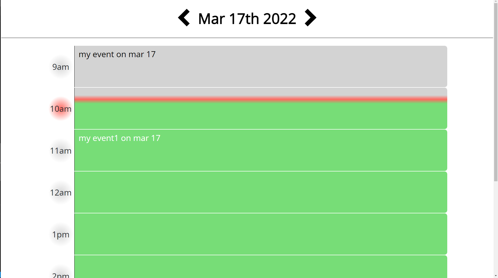
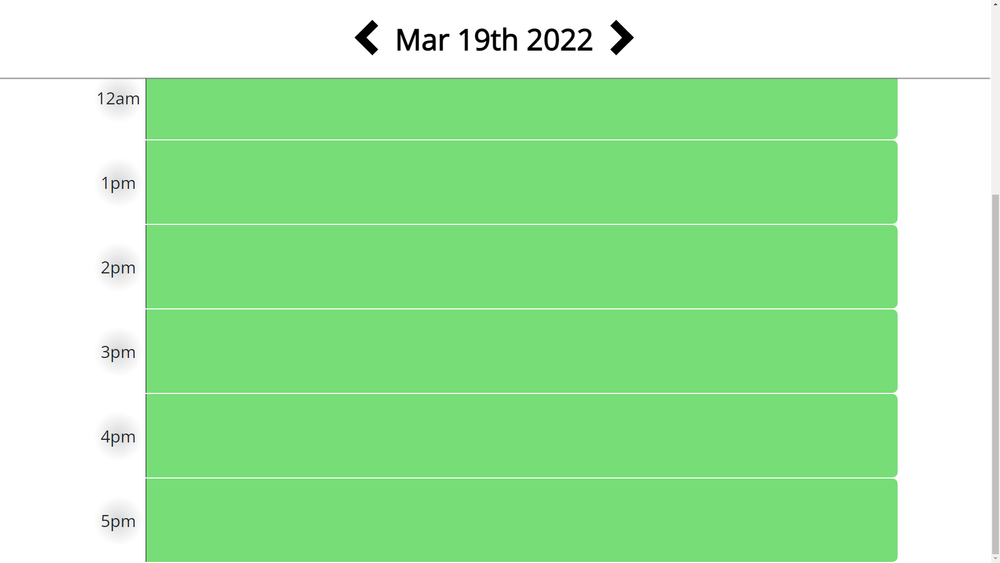

# Homework 5: Day Planner

## Description

In this assignment, I use JS in order to code a web app that allows the user to input text that is stored in a block denoted by a time between 8am and 5pm, in order to create a "calender". The code uses localStorage in order to allow the events to persist even wheen you reload the page. I use CSS grandients and animations in order to make the page look cleaner. The user can also change events in the past or in the future. The boxes are also color coded to past present and future, but the present box has a gradient on it with the red line denoting how far into the hour it is currently. The data for future and past dates also persists when you reload the page. All of this information updates in live time using an interval that runs every second.

## Links

Website: https://benw10-1.github.io/HW_5/  
Repo: https://github.com/benw10-1/HW_5

## Screenshots

